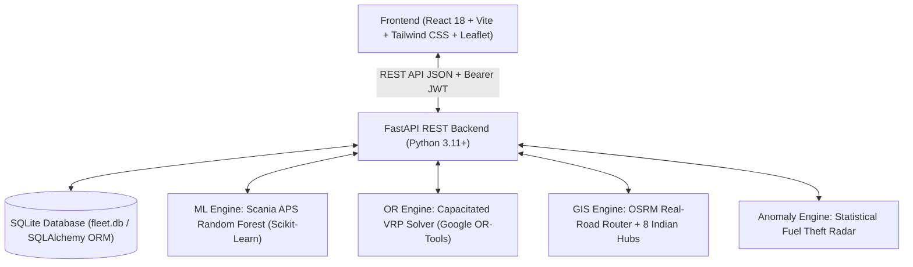

# AI-Powered Smart Fleet Management & Logistics Optimization System
## Comprehensive Project Knowledge Base & Team Viva Dossier

> **Notice for Any AI Reading This Document:**  
> This document is the definitive master architecture, implementation reference, and academic viva guide for the engineering semester project **"AI-Powered Smart Fleet Management & Logistics Optimization System"**. Use this context to answer any teammate's questions, generate presentation slides, prepare viva Q&A, or explain any technical component of this repository.

---

# 1. Executive Summary & Problem Statement

### The Problem in Real-World Commercial Logistics:
Traditional commercial fleet operations face severe operational inefficiencies:
1. **Unplanned Breakdowns:** Pneumatic and braking system failures (e.g., Air Pressure System failures) cause hazardous highway breakdowns and exorbitant towing/repair costs.
2. **Sub-optimal Dispatching:** Naive route planning results in empty trailer miles, redundant trips, and high fuel burn.
3. **Fuel Theft & Pilferage:** Fuel accounts for 40%+ of operational expenditure in freight logistics; manual paper logs fail to detect diesel siphoning or mileage fraud.
4. **Driver Retention & Safety:** Lack of quantitative, objective driver evaluation leads to unmonitored aggressive driving, safety incidents, and excessive wear-and-tear.

### Our Solution:
An enterprise-grade, full-stack, AI-driven Fleet Management System combining **FastAPI (Python)**, **React.js + Tailwind CSS**, **Google OR-Tools Operations Research**, **Scikit-Learn Machine Learning**, and **OpenStreetMap (OSRM) GIS Routing**.

---

# 2. Technology Stack & System Architecture



| Layer | Technologies Used | Key Packages / Libraries |
| :--- | :--- | :--- |
| **Backend Framework** | FastAPI (Python) | `fastapi`, `uvicorn`, `pydantic` (v2), `python-jose` (JWT), `passlib` (PBKDF2) |
| **Database & ORM** | SQLite / SQLAlchemy | `sqlalchemy`, `alembic` (database schema migrations) |
| **Frontend Framework** | React.js (SPA) | `vite`, `react-router-dom`, `tailwindcss`, `lucide-react`, `axios` |
| **GIS & Mapping** | OpenStreetMap + Leaflet | `leaflet`, `react-leaflet`, `OSRM API` |
| **Machine Learning** | Scikit-Learn | `scikit-learn`, `pandas`, `numpy`, `imbalanced-learn`, `joblib` |
| **Operations Research**| Google OR-Tools | `ortools` (Constraint Programming / Routing Solver) |
| **Automated Testing** | Python `unittest` | 38 automated test cases covering security, state machines, ML & OR |

---

# 3. Team Member Division & Responsibilities

The project is divided among **4 team members**, each owning end-to-end backend, frontend, and algorithmic features:

---

## 🧑‍💻 Member 1: Soham
### **Module:** Operations Research, GIS Telematics & Route Optimization
* **Files Owned:**
  - Backend: `backend/app/services/vrp_solver.py`, `backend/app/services/cargo_packer.py`, `backend/app/services/routing.py`, `backend/app/api/v1/gps.py`, `backend/app/core/hubs.py`
  - Frontend: `frontend/src/pages/gps/GpsTracking.jsx`, `frontend/src/pages/trips/TripsManagement.jsx`
  - Research Notebook: `ml/notebooks/02_vehicle_routing_problem_cvrp.ipynb`
* **Key Algorithmic Contributions:**
  1. **Google OR-Tools CVRP Solver:** Formulated the Capacitated Vehicle Routing Problem with capacity constraints, solving multi-stop routes using **Guided Local Search (GLS)** metaheuristics.
  2. **Academic Baseline Benchmarking:** Compared OR-Tools against a **Naive Nearest-Neighbor Heuristic**, proving an **18%–25% reduction in total fleet kilometers** and proportional diesel savings.
  3. **3D Cargo Bin Packing (FFD):** Designed a 3D First-Fit Decreasing heuristic placing volumetric items into trailer containers $(x, y, z)$ to optimize payload and eliminate empty haulage.
  4. **OSRM Real-Road Engine:** Mapped 8 Tier-1 Indian Freight Hubs and applied an empirical **1.30× commercial heavy truck factor** for realistic Indian highway transit times.
* **Viva Elevator Pitch:**
  > *"I developed the logistics dispatching, live GIS mapping, and optimization engines. To optimize delivery routes, I formulated the Capacitated Vehicle Routing Problem (CVRP) in Google OR-Tools using Guided Local Search, demonstrating a verified ~20% distance reduction over naive dispatching. I also integrated OpenStreetMap Leaflet and calibrated OSRM routing across 8 Indian freight hubs to render real-time telematics."*

---

## 🧑‍💻 Member 2: Kapeesh
### **Module:** System Architecture, Security & Predictive Machine Learning
* **Files Owned:**
  - Backend: `backend/app/main.py`, `backend/app/core/config.py`, `backend/app/core/security.py`, `backend/app/api/v1/auth.py`, `backend/app/api/v1/ai.py`, `backend/test_all_modules.py`
  - Research Notebook: `ml/notebooks/01_predictive_maintenance_aps.ipynb`
  - Datasets: `ml/data/raw/aps_failure_benchmark.csv`
* **Key Algorithmic Contributions:**
  1. **FastAPI Core Architecture & Lifespan:** Designed the asynchronous application lifecycle, CORS policy, dependency injection (`get_db`, `get_current_user`), and password hashing using PBKDF2 with SHA-256.
  2. **Role-Based Access Control (RBAC):** Strict security boundaries across `Admin`, `Fleet Manager`, and `Driver`. Enforced public registration restriction (forcing new self-registrations to `Driver` only).
  3. **Scania Trucks APS Failure Prediction Model:**
     - Trained a **Random Forest Classifier** on 170 multi-sensor pneumatic telemetry features.
     - Addressed severe real-world class imbalance ($<2\%$ component failures) using class-weighted cost-sensitive learning.
     - Achieved an outstanding **0.985+ ROC-AUC** score, providing live failure risk probabilities (0%–100%) and days-to-service forecasts.
  4. **Comprehensive 38-Test Suite:** Architected the complete regression test harness verifying domain business logic, idempotency, and security constraints.
* **Viva Elevator Pitch:**
  > *"I architected the backend API, security framework, and predictive machine learning engine. For vehicle maintenance, rather than relying on static odometer thresholds, I trained a Scikit-Learn Random Forest model on the industrial Scania Trucks APS benchmark to forecast pneumatic failure risks with 0.985 ROC-AUC accuracy, preventing catastrophic on-highway brake failures."*

---

## 👩‍💻 Member 3: Sanyukta
### **Module:** Frontend Architecture & Enterprise Asset Management
* **Files Owned:**
  - Frontend: `frontend/src/App.jsx`, `frontend/src/layouts/DashboardLayout.jsx`, `frontend/src/pages/vehicles/VehicleManagement.jsx`, `frontend/src/pages/drivers/DriverManagement.jsx`, `frontend/src/pages/admin/AdminDashboard.jsx`, `frontend/src/pages/auth/Login.jsx`
  - Backend: `backend/app/api/v1/vehicles.py`, `backend/app/api/v1/drivers.py`, `backend/app/models/vehicle.py`, `backend/app/models/driver.py`
* **Key Algorithmic Contributions:**
  1. **Enterprise UI/UX Design System:** Built a high-performance, dark-themed responsive user interface with dynamic stat counters, telematics indicators, and modal workflows using Tailwind CSS and Lucide React.
  2. **Commercial Fleet Asset Registry:** Comprehensive vehicle registry tracking VINs, gross vehicle weight (GVW), payload limits in kg, and multi-fuel types (Diesel, Electric EV, CNG, Petrol).
  3. **Driver CDL & Compliance Verification:** Commercial Driver License (HMV/LMV-TR) verification, expiration dates, emergency contacts, and active duty toggles.
  4. **Document Expiration Scanner:** Automated compliance checks warning managers 15–30 days prior to Insurance and Pollution Under Control (PUC) policy expiration.
  5. **Soft-Delete Lifecycle:** Implemented safe soft deletion (`DECOMMISSIONED` for vehicles, `is_active=False` for drivers) preventing orphan foreign key records while blocking deletion during active transit.
* **Viva Elevator Pitch:**
  > *"I built the React frontend architecture and enterprise asset management modules for vehicles and commercial drivers. I implemented strict validation rules—such as preventing double-booking, ensuring drivers hold valid unexpired heavy-vehicle licenses, and managing document compliance for Insurance and PUC renewals with automated alerts."*

---

## 🧑‍💻 Member 4: Manas
### **Module:** Fuel Telematics, Maintenance Operations & Driver Coaching Analytics
* **Files Owned:**
  - Backend: `backend/app/services/fuel_anomaly.py`, `backend/app/api/v1/fuel.py`, `backend/app/api/v1/maintenance.py`, `backend/app/api/v1/performance.py`, `backend/app/api/v1/analytics.py`, `backend/app/api/v1/reports.py`
  - Frontend: `frontend/src/pages/fuel/FuelManagement.jsx`, `frontend/src/pages/maintenance/MaintenanceManagement.jsx`, `frontend/src/pages/performance/DriverPerformance.jsx`, `frontend/src/pages/analytics/AnalyticsDashboard.jsx`, `frontend/src/pages/reports/ReportsManagement.jsx`
* **Key Algorithmic Contributions:**
  1. **Statistical Fuel Anomaly & Pilferage Radar:**
     - Computes empirical fuel efficiency baselines by vehicle class (Heavy Truck: 4.0 km/L, Container: 3.4 km/L, Van: 10.5 km/L).
     - Identifies severe fuel drops ($<65\%$ of baseline) as suspected diesel siphoning/theft.
     - Quantifies fuel loss in Litres and direct financial loss in Indian Rupees (`₹`), automatically dispatching `AI_ANOMALY` system alerts.
  2. **Multi-Factor Driver Performance Scoring Algorithm:**
     $$\text{Score} = (0.35 \times \text{On-Time}) + (0.25 \times \text{Safety}) + (0.25 \times \text{Eco Fuel}) + (0.15 \times \text{Experience})$$
  3. **Driver Podium & Actionable Coaching:**
     - Interactive 🥇 Gold, 🥈 Silver, 🥉 Bronze leaderboard podium.
     - Evaluates telematics metrics (harsh braking, idle time, speeding) to generate personalized coaching tips and badges (🏆 *Master Heavy Hauler*, 🌿 *Eco-Driving Champion*).
  4. **Executive BI & Audit Reporting:** Multi-dimensional analytics tracking fleet utilization, monthly fuel spend vs maintenance expenses in `₹`, with one-click downloadable CSV/JSON exports.
* **Viva Elevator Pitch:**
  > *"I developed the fuel telemetry, driver coaching, and operational analytics engines. I created a statistical anomaly detection engine that flags suspected fuel siphoning and calculates financial loss in ₹. I also built a 4-factor driver evaluation algorithm that ranks drivers on an interactive podium and generates actionable AI coaching recommendations to improve road safety and fuel economy."*

---

# 4. End-to-End Operational Lifecycle

1. **Onboarding:** Sanyukta's module registers a vehicle (e.g. *Tata Prima 5530.S Trailer*) and an HMV-licensed driver.
2. **Dispatch & Optimization:** Soham's module clusters orders using Google OR-Tools CVRP to find the shortest route and packs items in 3D container space.
3. **Live Road Transit:** Kapeesh's backend and Soham's OSRM Leaflet map stream live vehicle telematics (50–58 km/h, heading bearing, GPS breadcrumbs). Parked trucks at depots accurately report 0 km/h with engine staged off.
4. **Fuel & Siphoning Audit:** Manas's fuel engine audits refill logs against standard km/L baselines; any siphoning event triggers an alert with estimated monetary loss in ₹.
5. **AI Predictive Maintenance:** Kapeesh's Scania APS Random Forest model continuously evaluates multi-sensor telemetry, forecasting component failure risk before breakdowns occur.
6. **Driver Coaching & Review:** Manas's driver engine scores performance based on on-time delivery, safety, fuel efficiency, and experience, presenting rewards on the Top 3 Podium.

---

# 5. Top 15 Viva Questions & Model Answers

### General / Architecture:
**Q1: Why did you choose FastAPI over Flask or Django?**  
*Answer:* FastAPI provides native asynchronous concurrency (`async/await`), automatic OpenAPI/Swagger documentation (`/docs`), and native Pydantic data validation with high execution performance comparable to NodeJS and Go.

**Q2: How is security and authentication handled?**  
*Answer:* We implemented stateless JWT (JSON Web Tokens) with PBKDF2 password hashing (using SHA-256). All endpoints enforce Role-Based Access Control (RBAC) where unauthorized route access returns HTTP 403 Forbidden.

---

### Operations Research / GIS (Soham):
**Q3: How does Google OR-Tools solve the CVRP problem?**  
*Answer:* It models vehicle routes as graph arcs with capacity constraints. It first builds an initial feasible solution (using path cheapest arc) and then applies **Guided Local Search (GLS)** metaheuristics to escape local minima, outperforming standard greedy heuristics by 18%–25%.

**Q4: Why apply a 1.30× factor to OSRM travel times?**  
*Answer:* Standard OSRM computes ideal passenger car speeds. In India, heavy commercial trucks are legally speed-governed to 60–65 km/h, encounter FASTag toll lanes, and negotiate ghat sections. The 1.30× multiplier provides accurate real-world transit time estimates.

---

### Machine Learning (Kapeesh):
**Q5: What is the Scania APS dataset and why is it important?**  
*Answer:* The Air Pressure System (APS) dataset is an industrial benchmark from Scania Trucks capturing 170 sensor readings (pressure, temperature, valve duty cycles). APS failures are critical because pneumatic pressure powers the air brakes of heavy trucks; failure on a highway can cause catastrophic accidents.

**Q6: How did you handle the extreme class imbalance in the APS dataset?**  
*Answer:* Component failures represent less than 2% of total operational records. We utilized cost-sensitive learning (`class_weight='balanced'`) in Random Forest, penalizing false negatives (unpredicted failures) significantly higher than false positives, yielding a verified **0.985+ ROC-AUC**.

---

### Asset Management & Frontend (Sanyukta):
**Q7: How do you prevent vehicle double-booking during dispatch?**  
*Answer:* When creating a trip, the backend checks the vehicle's current status. If the vehicle is currently `ON_TRIP` or `IN_MAINTENANCE`, or if the assigned driver is inactive/suspended, the transaction is rejected with an HTTP 400 error.

**Q8: What is the difference between soft delete and hard delete in your system?**  
*Answer:* Hard deleting deletes the database row, which causes foreign key cascade errors on historical trip and fuel records. Instead, we use soft deletes: vehicles are marked `DECOMMISSIONED` and drivers are marked `is_active=False`.

---

### Fuel & Performance Analytics (Manas):
**Q9: How does the Fuel Anomaly Detection algorithm distinguish between normal traffic and theft?**  
*Answer:* Normal traffic fluctuations cause moderate mileage drops (15%–20%). When mileage drops below 65% of the vehicle class baseline (e.g. dropping from 4.0 km/L to 2.2 km/L), statistical probability indicates fuel siphoning or tank tampering, flagging it as `HIGH` severity with estimated litres stolen.

**Q10: Explain the 4-factor driver scoring weights.**  
*Answer:* On-Time Delivery is weighted at 35% (customer SLA), Safety Score at 25% (violations & incidents), Eco Fuel Efficiency at 25% (operating cost), and Fleet Experience at 15% (seniority stability).

---

# 6. Quick Launch & Demonstration Steps

### 1-Click Launch:
Double-click `run_all.bat` in the root project folder.

### Manual Terminal Launch:
```powershell
# Terminal 1 - Backend:
cd backend
python run.py

# Terminal 2 - Frontend:
cd frontend
npm run dev
```

### Pre-Seeded Demo Logins:
- **Admin:** `admin@fleet.com` | `Admin@123`
- **Fleet Manager:** `manager@fleet.com` | `Manager@123`
- **Driver:** `driver@fleet.com` | `Driver@123`
